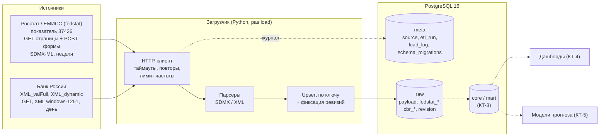

# Прогнозно-аналитическая система цен на плодоовощную продукцию

Учебный проект по дисциплине «Прогнозно-аналитические системы» (профиль «Управление данными»), тема № 8 «Продовольственный рынок».

**Прогнозируемый показатель:** средняя потребительская цена (руб./кг) на картофель, капусту белокочанную, лук репчатый, морковь и яблоки по субъектам РФ, недельный шаг, горизонт 4–8 недель.
**Пользователь:** аналитик закупок розничной сети или регионального органа управления торговлей.

Постановка задачи и ход работы описаны в [docs/report.md](docs/report.md).

## Архитектура



Пунктиром показаны компоненты следующих контрольных точек.

| Слой | Ответственность |
|---|---|
| `meta` | Реестр источников, запуски (`etl_run`), журнал шагов загрузки (`load_log`), версии схемы (`schema_migrations`). |
| `raw` | Данные в том виде, в каком их отдал источник. Сырые ответы хранятся целиком в `raw.payload` (gzip, sha256, параметры запроса); разобранные строки — в `raw.fedstat_obs`, `raw.cbr_rate` и справочниках. Изменения ранее загруженных значений пишутся в `raw.revision`. |
| `core`, `mart` | Очищенные и согласованные данные, недельная витрина для моделей и дашбордов (КТ-3). |

## Стек

| Компонент | Выбор | Почему |
|---|---|---|
| Хранилище | PostgreSQL 16 в Docker | Полноценный SQL, транзакции, jsonb для метаданных; одинаково разворачивается на любой машине. |
| Загрузка | Python 3.11: requests, lxml, psycopg 3 | lxml быстро разбирает SDMX-файлы на несколько мегабайт; psycopg 3 даёт COPY для массовой вставки. |
| Конфигурация | `config/config.yaml` + `.env` | Параметры источников отдельно от секретов подключения. |
| Схема БД | SQL-миграции `sql/migrations/NNN_*.sql` | Каждое изменение схемы — новый файл; применённые миграции защищены контрольной суммой. |

## Запуск

Нужны Docker Desktop и Python 3.11+.

```powershell
copy .env.example .env
docker compose up -d db
python -m venv .venv
.venv\Scripts\activate
pip install -e ".[dev]"

pas init-db      # применить миграции
pas load         # загрузить оба источника (инкрементально)
pas status       # журнал загрузок и свежесть данных
```

Для bash вместо `copy` и `activate`: `cp .env.example .env`, `source .venv/Scripts/activate` (Windows) или `source .venv/bin/activate` (Linux/macOS).

| Команда | Что делает |
|---|---|
| `pas init-db` | Применяет новые миграции; повторный запуск ничего не меняет. |
| `pas load [--source all\|cbr\|fedstat]` | Инкрементальная загрузка. ЦБ — с даты последнего курса минус 7 дней перекрытия; fedstat — с последнего загруженного года. |
| `pas load --source cbr --force` | Игнорировать ограничение «не чаще раза в сутки» для ЦБ. |
| `pas load --source fedstat --full` | Перезагрузить всю историю с `start_year` (изменённые значения попадут в `raw.revision`). |
| `pas load --source fedstat --from-year 2025` | Перезагрузить годы начиная с указанного. |
| `pas status` | Последние запуски, журнал шагов, свежесть данных. |

Код возврата `pas load`: 0 — все шаги успешны или пропущены по лимиту; 1 — хотя бы один шаг завершился ошибкой.

## Как проверить загрузку через SQL

```powershell
docker compose exec db psql -U pas -d pas
```

```sql
select * from meta.v_run order by run_id desc limit 5;              -- запуски
select * from meta.v_load_log order by load_id desc limit 20;       -- шаги загрузки
select * from meta.v_freshness;                                     -- покрытие данных
select payload_id, source, entity, byte_size, fetched_at from raw.payload order by 1 desc limit 5;
```

## Структура репозитория

```
config/config.yaml        параметры источников, HTTP, выбор товаров и территорий
docker-compose.yml        PostgreSQL
sql/migrations/           схема БД (meta, raw, представления)
src/pas/cli.py            команды init-db / load / status
src/pas/fedstat.py        загрузчик fedstat: страница показателя, форма выгрузки, разбор SDMX
src/pas/cbr.py            загрузчик Банка России
src/pas/storage.py        сохранение сырых ответов, upsert с фиксацией ревизий
src/pas/journal.py        журнал запусков и шагов
src/pas/http.py           HTTP-сессия с таймаутами и повторами
tests/                    тесты парсеров (pytest)
docs/report.md            отчёт
```

## Тесты

```powershell
pytest
```
